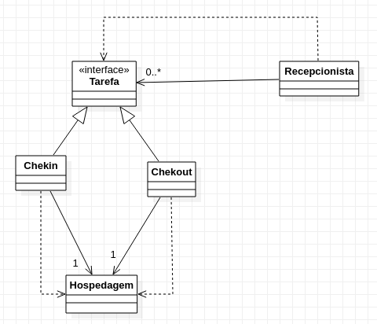

## 3. Padrões comportamentais

---

### 3.10 Command

### 3.10.1 Introdução

Trata-se de um padrão de design comportamental que transforma uma solicitação em um objeto autônomo que contpem todas as informações sobre a solicitação.
### 3.10.2 Exemplo abordado:

Para tal padrão de projeto, implementei um exemplo relacionado a tarefas de uma recepcionista quanto a hospedagem de hospede

### 3.10.3 Diagrama de classe do exemplo

